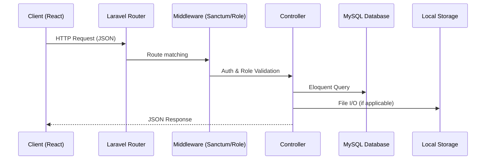

# System Architecture

The architecture utilizes a strict client-server decoupling.

```mermaid
sequenceDiagram
    participant C as Client (React)
    participant R as Laravel Router
    participant M as Middleware (Sanctum/Role)
    participant Ctl as Controller
    participant DB as MySQL Database
    participant S as Local Storage

    C->>R: HTTP Request (JSON)
    R->>M: Route matching
    M->>Ctl: Auth & Role Validation
    Ctl->>DB: Eloquent Query
    Ctl->>S: File I/O (if applicable)
    Ctl-->>C: JSON Response
```
