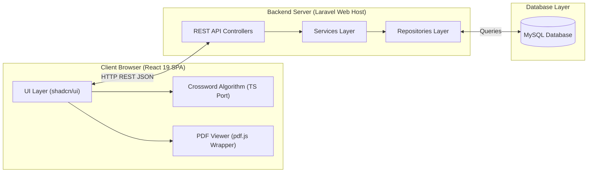

# System Architecture Design

This document details the high-level architecture, design principles, and component interaction models for the Scrabble Wordseser MVP.

## 1. High-Level Architecture
The application uses a separated client-server model:
- **Frontend Layer**: Single Page Application (SPA) built with React 19, TypeScript, TailwindCSS 4, and shadcn/ui. Runs completely inside the client browser.
- **Backend API Layer**: REST API built with Laravel, exposing stateless token-authenticated JSON endpoints.
- **Database Storage Layer**: MySQL database storing users, courses, materials, crossword metadata, and student score history.

---

## 2. Design Principles
- **Separation of Concerns (SoC)**:
  - The frontend manages user experience, PDF canvas rendering, interactive crossword inputs, and score calculations.
  - The backend manages authorization checks, file storage persistence, scoring validations, and history audit trails.
- **Stateless Authenticated Requests**: The API requires a Bearer token (via Laravel Sanctum) for all secure requests, avoiding server-side sessions.
- **Heuristic Layout Placement**: Crossword grid layouts are generated dynamically in the frontend client browser using our ported greedy layout generator. This keeps server processor load minimal.

---

## 3. Module Interaction Model
- **PDF Upload and Course Creation**:
  1. A teacher submits a PDF file and crossword answers via the React UI.
  2. The frontend sends a multipart/form-data request containing the file and solution key to the backend.
  3. Laravel validates the input, uploads the PDF to filesystem storage, and writes metadata (file paths, answer keys) to MySQL.
- **Student Crossword Submission**:
  1. A student opens a course material, rendering the PDF on a canvas and generating the crossword grid from the solution key.
  2. Once solved, the student clicks "Submit".
  3. The React app compares the student's inputs with the crossword key, calculates the score, and calls the backend API to save the attempt.
  4. Laravel saves the attempt details to the history table and returns a confirmation JSON response.
