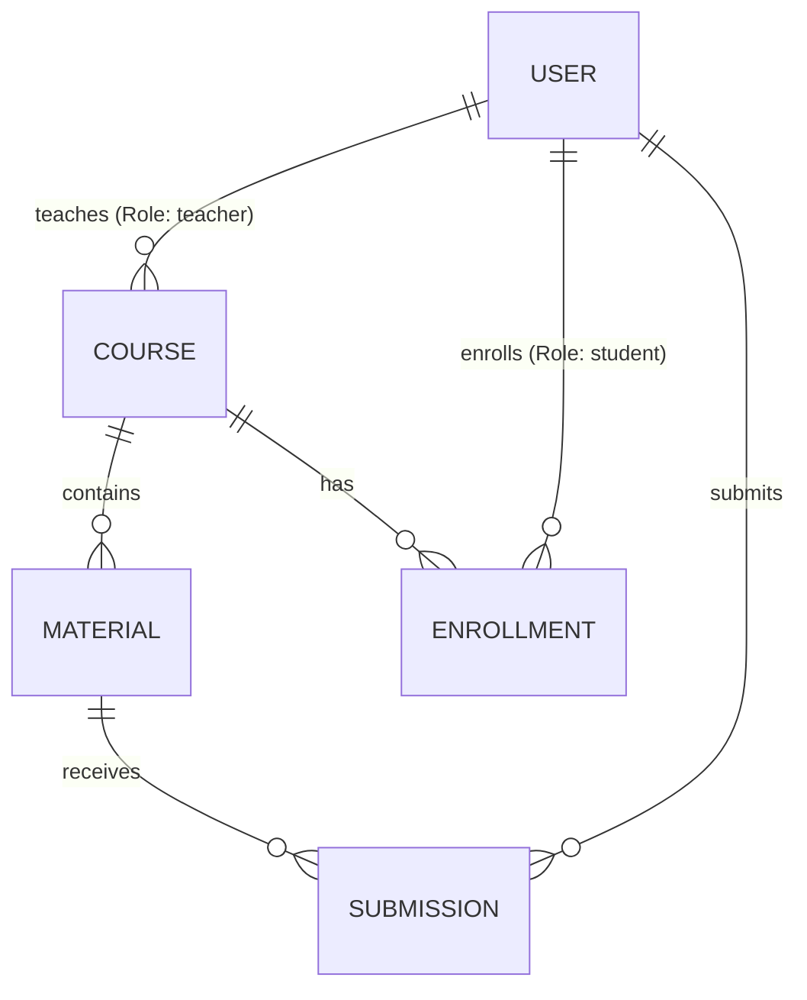

# Database Entity Design

This document details database entities, properties, and relationship mappings for the Scrabble Wordseser MVP. No SQL code is included.

## 1. Entities & Fields

### User
- **Responsibility**: Stores login credentials, roles, and profiles.
- **Attributes**:
  - `id` (Primary Key, integer)
  - `name` (string)
  - `email` (string, unique)
  - `password` (string, hashed)
  - `role` (enum: `'teacher'`, `'student'`)
  - `created_at` / `updated_at` (timestamps)

### Course
- **Responsibility**: Groups learning materials and tracks student enrollments.
- **Attributes**:
  - `id` (Primary Key, integer)
  - `name` (string)
  - `description` (text)
  - `teacher_id` (Foreign Key -> User.id)
  - `created_at` / `updated_at` (timestamps)

### Material
- **Responsibility**: Stores study materials, linking PDF files to crossword clues and answers.
- **Attributes**:
  - `id` (Primary Key, integer)
  - `course_id` (Foreign Key -> Course.id)
  - `title` (string)
  - `pdf_path` (string, file system path)
  - `crossword_data` (json: array of clues, coordinates, and solution keys)
  - `created_at` / `updated_at` (timestamps)

### Enrollment
- **Responsibility**: Maps students to enrolled courses (pivot table).
- **Attributes**:
  - `id` (Primary Key, integer)
  - `student_id` (Foreign Key -> User.id)
  - `course_id` (Foreign Key -> Course.id)
  - `created_at` (timestamp)

### Submission
- **Responsibility**: Records student attempts and scores for crossword puzzles.
- **Attributes**:
  - `id` (Primary Key, integer)
  - `student_id` (Foreign Key -> User.id)
  - `material_id` (Foreign Key -> Material.id)
  - `score` (integer, e.g. 0-100)
  - `answers_submitted` (json, student entries log)
  - `completed_at` (timestamp)

---

## 2. Entity Relationships (ERD Mapping)

- **User to Course**: 1-to-many relationship (a teacher can create multiple courses).
- **Course to Material**: 1-to-many relationship (a course can contain multiple study materials).
- **User to Course (Enrollment)**: Many-to-many relationship mapping student enrollments.
- **Student to Material (Submission)**: Many-to-many relationship tracking student submissions, containing score metadata.
