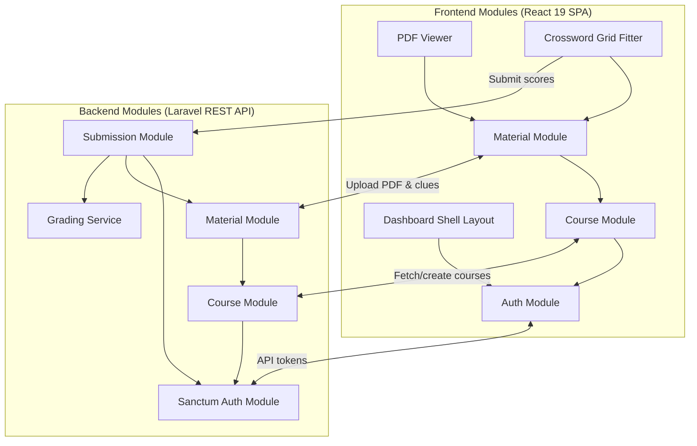

# Architecture Module Dependency Graph

This document visualizes dependencies and relationships between the application's backend and frontend modules.

## Module Dependency Chart

- **Authentication Dependency**: All secure frontend modules depend on the Auth Module to provide access tokens for secure API requests.
- **Material Dependency**: Both the PDF Viewer and Crossword modules depend on the Material Module to load the PDF files and crossword clue configurations.
- **Submissions Dependency**: The backend Submission module coordinates with the Grading Service and Material module to grade student attempts and save results.
