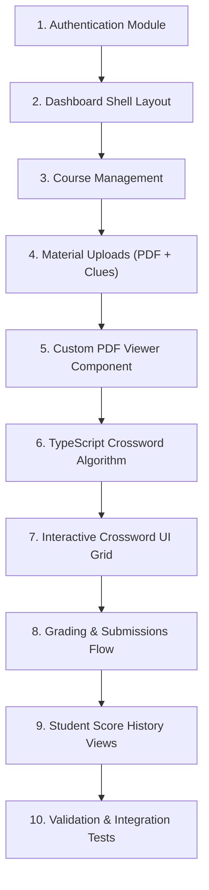

# Implementation Order Blueprint

This document defines the step-by-step order for building and testing the Scrabble Wordseser MVP.

## Implementation Flow

---

## Breakdown of Phases

### Phase 1: Foundation (Milestones 1 - 3)
1. **Authentication**: Set up backend auth (Sanctum tokens) and frontend auth screens (login, registration).
2. **Dashboard Shell**: Build the sidebar and header layouts, adopting patterns from `shadcn-admin`.
3. **Course Management**: Implement course creation (Teacher) and enrollment views (Student).

### Phase 2: Material & Learning Portals (Milestones 4 - 7)
4. **Material Upload**: Implement PDF uploads on the backend and build the teacher upload form.
5. **PDF Viewer**: Integrate `pdfjs-dist` to render pages onto a custom canvas view component.
6. **TypeScript Crossword Port**: Port the crossword layout generator logic into a reusable utility.
7. **Crossword Grid UI**: Build the interactive crossword input grid.

### Phase 3: Validation & Audits (Milestones 8 - 10)
8. **Grading & Submissions**: Send student inputs to the backend API to grade crosswords and save submissions.
9. **Student History**: Build student score history tables, adopting pagination layouts from `shadcn-table`.
10. **Testing**: Run integration and user flow tests to verify the application works as expected.
