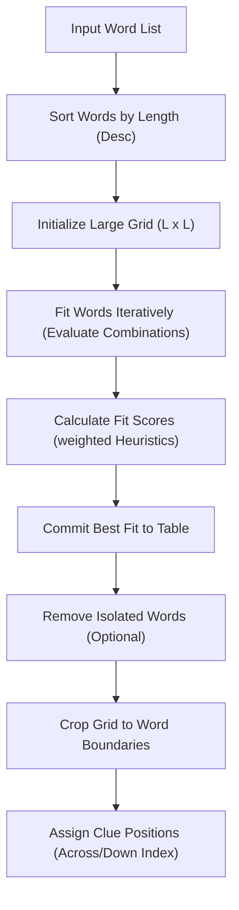

# Crossword Layout Algorithms Knowledge Base

This document synthesizes the crossword layout generator logic, grid placement steps, collision rules, and scoring models.

## 1. Grid Generator Flow
The grid generation workflow involves several steps:
1. **Initialize Canvas**: Uses `initTable(rows, cols)` to construct a 2D array of cells initialized to a default blank character `"-"`. The initial dimensions (`rows` and `cols`) are calculated as:
   `longestWordLength * factor` (where factor is typically `3`).
2. **Sort Words**: Sorts input words by length in descending order, prioritizing longer words as the primary anchors for the grid.
3. **GREEDY FIT Placement**: Iterates through each word, testing all possible coordinate cells `(i, j)` in both horizontal (orientation 0) and vertical (orientation 1) directions.
4. **Isolated Word Cleanup**: Runs `removeIsolatedWords` after fitting to strip out words that failed to cross with other words. This keeps the puzzle connected.
5. **Crop Boundaries**: Shrinks the grid using `trimTable` to fit the exact boundaries of the placed words, adjusting coordinates accordingly.

## 2. Collision Detection
The algorithm checks for conflicts before placing a word:
- **Character Matching**: The character at a target grid cell must either be blank (`"-"`) or match the character of the word being placed (`character == table[i][j]`).
- **Adjacency Checks**: To prevent words from running side-by-side without crossing, cells adjacent to blank segments of the placed word must be empty.
  - For horizontal placement, cells above (`i - 1`) and below (`i + 1`) the target cell must be empty (`"-"`).
  - For vertical placement, cells to the left (`j - 1`) and right (`j + 1`) of the target cell must be empty.
- **Terminal Checks**: Cells immediately preceding and succeeding the word must be empty to prevent words from blending together.

## 3. Heuristic Scoring Model
The placement score is calculated using `weightedAverage(weights, values)` across four metrics:
- **Metric 1: Connection Density** (`computeScore1`):
  `connections / (word.length / 2)` (Favors placements that cross multiple words).
- **Metric 2: Distance from Center** (`computeScore2`):
  `1 - (ManhattanDistance(center, position) / maxPossibleDistance)` (Favors placing words near the center of the grid).
- **Metric 3: Direction Balance** (`computeScore3`):
  Checks the ratio of vertical to horizontal words, favoring placements that balance the grid's overall orientation.
- **Metric 4: Word Length Ratio** (`computeScore4`):
  `word.length / gridRows` (Favors placing longer words).
