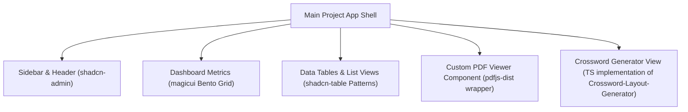

# Master Reference Repositories Index

This master index aggregates performance scores and technical evaluations for the 6 analyzed reference repositories.

## Evaluation Index Table

| Repository | Purpose | License | Arch Score | UI Score | Algo Score | Maint Score | Learning Value | Recommended Usage | Priority | Overall Recommendation |
|---|---|---|---|---|---|---|---|---|---|---|
| **Crossword-Layout-Generator** | Crossword grid layout fitter | MIT | 5/10 | 3/10 | 8/10 | 7/10 | 8/10 | Port core fitting algorithm to TS | **High** | Reimplement the core fitting algorithm, but build a custom UI. |
| **awesome-shadcn-ui** | Curated catalog of shadcn/ui resources | MIT | N/A | N/A | N/A | N/A | 5/10 | Reference list for finding UI assets | **Low** | Use as an index to discover additional UI inputs if needed. |
| **magicui** | Animated interactive UI library | MIT | 8/10 | 10/10 | 7/10 | 8/10 | 9/10 | Copy bento-grid, blur-fade, glow buttons | **Medium** | Copy visual components directly into the codebase. |
| **pdf.js** | HTML5 client-side PDF rendering engine | Apache-2.0 | 9/10 | 5/10 | 9/10 | 6/10 | 8/10 | Wrap core rendering APIs | **High** | Use `pdfjs-dist` to load and render pages onto a custom canvas. |
| **shadcn-admin** | Modular admin dashboard starter | MIT | 8/10 | 9/10 | 5/10 | 8/10 | 9/10 | Sidebar layout and theme switches | **High** | Adopt its responsive sidebar and feature-based folder structure. |
| **shadcn-table** | Database table with filters and sorting | MIT | 8/10 | 9/10 | 8/10 | 7/10 | 9/10 | Reference pagination and search filters | **Medium** | Use as a design blueprint for page lists and history views. |

---

## Overall Integration Strategy

